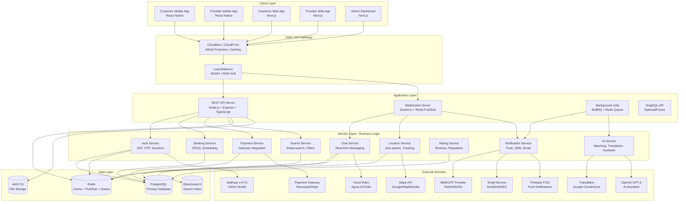
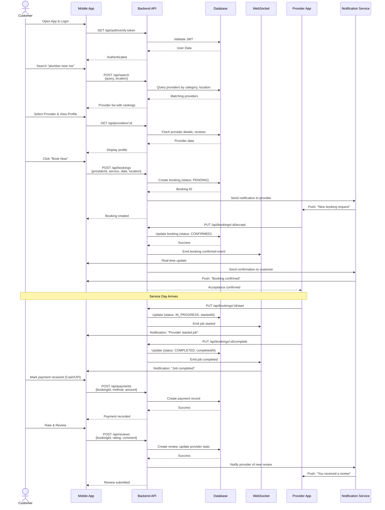
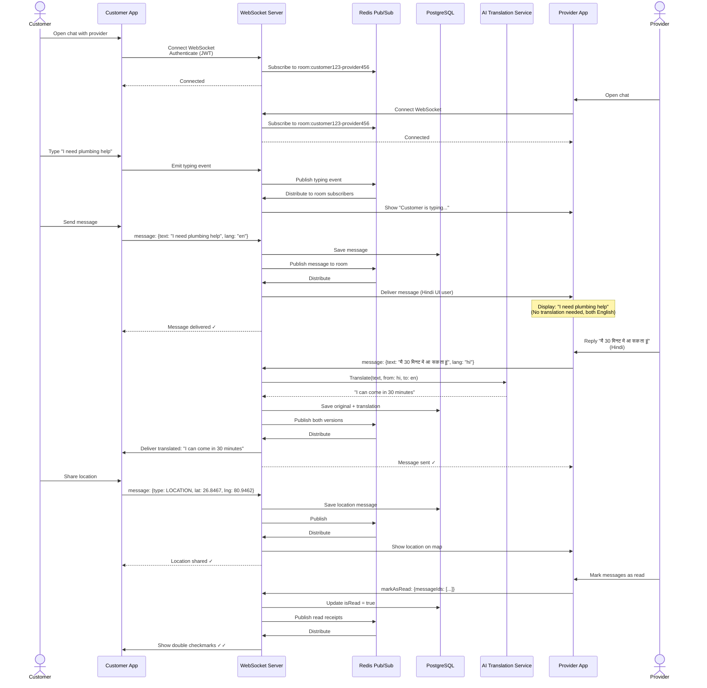
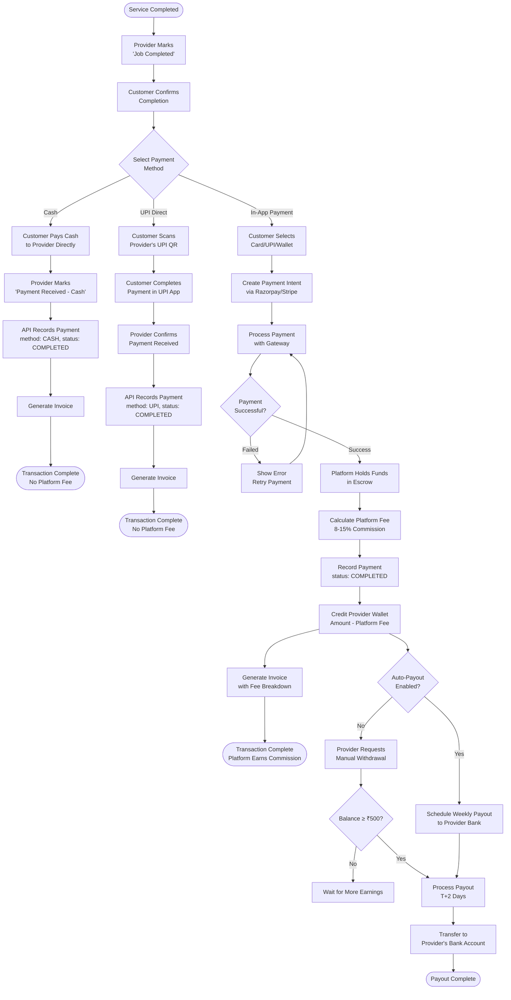
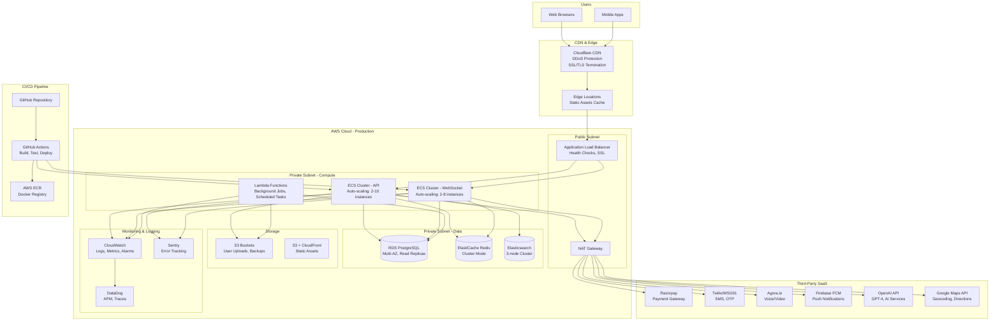

# LocalPro Connect — Architecture & Flow Diagrams

## 1. SYSTEM ARCHITECTURE DIAGRAM



---

## 2. DATABASE ENTITY RELATIONSHIP DIAGRAM

```mermaid
erDiagram
    User ||--o| CustomerProfile : has
    User ||--o| ProviderProfile : has
    User {
        uuid id PK
        enum role
        string phone UK
        string email UK
        string name
        string profilePhoto
        datetime createdAt
        datetime updatedAt
    }

    CustomerProfile ||--o{ Booking : creates
    CustomerProfile ||--o{ Review : writes
    CustomerProfile ||--o{ ChatRoom : participates
    CustomerProfile {
        uuid id PK
        uuid userId FK
        date dateOfBirth
        json addresses
        json savedLocations
    }

    ProviderProfile ||--o{ Booking : receives
    ProviderProfile ||--o{ Review : receives
    ProviderProfile ||--o{ ChatRoom : participates
    ProviderProfile }o--|| Category : belongsTo
    ProviderProfile {
        uuid id PK
        uuid userId FK
        string businessName
        text description
        uuid categoryId FK
        json subCategoryIds
        boolean aadhaarVerified
        string aadhaarMasked
        boolean backgroundVerified
        json serviceAreas
        point baseLocation
        json pricing
        json workingHours
        int totalJobs
        int completedJobs
        decimal averageRating
        decimal reputationScore
        int responseTime
    }

    Category ||--o{ SubCategory : contains
    Category {
        uuid id PK
        string name
        json nameTranslations
        string icon
        text description
        boolean isActive
        int sortOrder
    }

    SubCategory {
        uuid id PK
        uuid categoryId FK
        string name
        json nameTranslations
        text description
        boolean isActive
    }

    Booking ||--o| Payment : has
    Booking ||--o| Review : has
    Booking ||--o| ChatRoom : linkedTo
    Booking {
        uuid id PK
        string bookingNumber UK
        uuid customerId FK
        uuid providerId FK
        string serviceType
        json serviceLocation
        datetime scheduledDate
        json scheduledTime
        enum status
        text cancellationReason
        enum cancelledBy
        text specialInstructions
        decimal quotedPrice
        decimal finalPrice
        string currency
        datetime createdAt
        datetime confirmedAt
        datetime startedAt
        datetime completedAt
        datetime cancelledAt
    }

    Payment {
        uuid id PK
        uuid bookingId FK
        decimal amount
        string currency
        enum method
        enum status
        string transactionId
        json gatewayResponse
        decimal platformFee
        decimal providerEarnings
        datetime paidAt
        datetime refundedAt
        datetime createdAt
    }

    Review {
        uuid id PK
        uuid bookingId FK UK
        uuid customerId FK
        uuid providerId FK
        int overallRating
        int qualityRating
        int punctualityRating
        int professionalismRating
        int valueRating
        text comment
        json photos
        boolean isPublished
        boolean isFlagged
        string flagReason
        text providerResponse
        datetime respondedAt
        int helpfulCount
        datetime createdAt
        datetime updatedAt
    }

    ChatRoom ||--o{ Message : contains
    ChatRoom {
        uuid id PK
        uuid customerId FK
        uuid providerId FK
        uuid bookingId FK
        datetime lastMessageAt
        datetime createdAt
    }

    Message }o--|| User : sentBy
    Message {
        uuid id PK
        uuid chatRoomId FK
        uuid senderId FK
        enum type
        text content
        text originalContent
        string detectedLanguage
        string mediaUrl
        json location
        boolean isRead
        datetime readAt
        datetime createdAt
    }
```

---

## 3. CUSTOMER BOOKING FLOW



---

## 4. REAL-TIME CHAT FLOW



---

## 5. PROVIDER ONBOARDING & VERIFICATION FLOW

```mermaid
flowchart TD
    Start([Provider Downloads App]) --> SignUp[Sign Up with Mobile]
    SignUp --> OTP[Enter OTP]
    OTP --> OTPVerify{OTP Valid?}
    OTPVerify -->|No| OTP
    OTPVerify -->|Yes| BasicInfo[Enter Basic Info<br/>Name, Email, DOB]

    BasicInfo --> BusinessInfo[Enter Business Details<br/>Category, Services, Pricing]
    BusinessInfo --> ServiceArea[Set Service Areas<br/>Location, Radius]
    ServiceArea --> UploadDocs[Upload Documents<br/>Profile Photo, Portfolio]

    UploadDocs --> AadhaarStart{Aadhaar<br/>Verification?}
    AadhaarStart -->|Skip| ProfileReview
    AadhaarStart -->|Verify| EnterAadhaar[Enter Aadhaar Number]

    EnterAadhaar --> AadhaarAPI[Call Aadhaar e-KYC API]
    AadhaarAPI --> AadhaarOTP[Receive OTP on<br/>Aadhaar-registered Mobile]
    AadhaarOTP --> VerifyAadhaarOTP[Enter & Verify OTP]

    VerifyAadhaarOTP --> AadhaarValid{Valid?}
    AadhaarValid -->|No| EnterAadhaar
    AadhaarValid -->|Yes| AutoPopulate[Auto-populate Name, DOB, Address<br/>from Aadhaar]

    AutoPopulate --> SaveMasked[Store Masked Aadhaar<br/>XXXX-XXXX-1234]
    SaveMasked --> AwardBadge[Award 'Aadhaar Verified' Badge]

    AwardBadge --> BGCheck{Background<br/>Check?}
    BGCheck -->|Skip| ProfileReview
    BGCheck -->|Yes| PayBGFee[Pay ₹500-1000 Fee]

    PayBGFee --> InitiateBG[Initiate Background Verification<br/>with Third-Party Agency]
    InitiateBG --> WaitBG[Wait 2-5 Days]
    WaitBG --> BGResult{Verification<br/>Passed?}

    BGResult -->|Failed| Reject[Notify Provider<br/>Cannot Award Badge]
    BGResult -->|Passed| AwardBGBadge[Award 'Background Verified' Badge]

    Reject --> ProfileReview
    AwardBGBadge --> ProfileReview[Submit for Admin Review]

    ProfileReview --> AdminCheck{Admin<br/>Approval}
    AdminCheck -->|Rejected| NotifyFix[Notify Provider<br/>Reason for Rejection]
    NotifyFix --> FixProfile[Provider Fixes Issues]
    FixProfile --> ProfileReview

    AdminCheck -->|Approved| ProfileLive[Profile Goes Live]
    ProfileLive --> Dashboard[Provider Dashboard<br/>Ready to Receive Bookings]
    Dashboard --> End([Start Receiving Requests])
```



---

## 6. PAYMENT FLOW (Multiple Methods)



---

## 7. AI MATCHING & RECOMMENDATION ALGORITHM

```mermaid
flowchart TD
    Start([Customer Searches]) --> InputQuery[Input: Query + Location]
    InputQuery --> ParseQuery[NLP Parse Query<br/>Extract Intent]

    ParseQuery --> IntentType{Query Type}
    IntentType -->|Natural Language| NLP[AI Extracts:<br/>Service Type, Location, Time]
    IntentType -->|Direct Search| Direct[Direct Category:<br/>e.g., 'Plumber']

    NLP --> MapCategory[Map to Service Category<br/>& Sub-category]
    Direct --> MapCategory

    MapCategory --> GeoSearch[Geospatial Search<br/>Providers within Radius]
    GeoSearch --> InitialPool[Initial Provider Pool<br/>n candidates]

    InitialPool --> FilterActive{Active &<br/>Available?}
    FilterActive -->|No| Remove1[Remove from Pool]
    FilterActive -->|Yes| CheckVerification

    CheckVerification --> CalculateScore[Calculate Match Score<br/>for Each Provider]

    CalculateScore --> ScoreFactors[Score = Weighted Sum:<br/>• Rating: 40%<br/>• Verification: 20%<br/>• Response Time: 15%<br/>• Distance: 15%<br/>• Availability: 10%]

    ScoreFactors --> Personalization[Apply Personalization:<br/>• Previous Bookings<br/>• Customer Preferences<br/>• Provider Specialization]

    Personalization --> ReputationBoost{High Reputation<br/>Provider?}
    ReputationBoost -->|Yes| Boost[+10% Score Boost]
    ReputationBoost -->|No| NoBoost[No Boost]

    Boost --> FinalScore
    NoBoost --> FinalScore[Final Match Score<br/>0-100]

    FinalScore --> RankProviders[Rank All Providers<br/>by Score Descending]
    RankProviders --> ApplyFilters[Apply User Filters:<br/>Price, Rating, Distance]

    ApplyFilters --> FinalList[Final Ranked List]
    FinalList --> DisplayTop[Display Top 20 Results]

    DisplayTop --> UserSelects[Customer Selects Provider]
    UserSelects --> LogInteraction[Log Interaction for ML<br/>Improve Future Rankings]
    LogInteraction --> End([Booking Initiated])

    Remove1 --> CalculateScore
```



---

## 8. REPUTATION SCORING ALGORITHM

```mermaid
flowchart TD
    Start([New Review Submitted]) --> FetchProvider[Fetch Provider Profile]

    FetchProvider --> BaseRating[Calculate Base Rating:<br/>Avg of All Star Ratings]
    BaseRating --> CategoryRating[Calculate Category Ratings:<br/>Quality, Punctuality, etc.]

    CategoryRating --> JobsCompleted{Total Jobs<br/>Completed}
    JobsCompleted -->|< 10| NewProvider[New Provider Penalty<br/>-10 Points]
    JobsCompleted -->|10-50| MidProvider[Normal Scoring]
    JobsCompleted -->|> 50| ExperiencedBonus[Experience Bonus<br/>+15 Points]

    NewProvider --> ResponseTime
    MidProvider --> ResponseTime
    ExperiencedBonus --> ResponseTime[Calculate Avg<br/>Response Time]

    ResponseTime --> ResponseScore{Response Time}
    ResponseScore -->|< 10 min| FastBonus[Quick Responder<br/>+10 Points]
    ResponseScore -->|10-60 min| NormalResponse[Normal: 0 Points]
    ResponseScore -->|> 60 min| SlowPenalty[Slow Response<br/>-5 Points]

    FastBonus --> VerificationCheck
    NormalResponse --> VerificationCheck
    SlowPenalty --> VerificationCheck[Check Verification Status]

    VerificationCheck --> AadhaarCheck{Aadhaar<br/>Verified?}
    AadhaarCheck -->|Yes| AadhaarBonus[+10 Points]
    AadhaarCheck -->|No| NoAadhaar[0 Points]

    AadhaarBonus --> BGCheck{Background<br/>Verified?}
    NoAadhaar --> BGCheck
    BGCheck -->|Yes| BGBonus[+10 Points]
    BGCheck -->|No| NoBG[0 Points]

    BGBonus --> CancellationCheck
    NoBG --> CancellationCheck[Check Cancellation Rate]

    CancellationCheck --> CancelRate{Cancellation<br/>Rate}
    CancelRate -->|< 5%| GoodRecord[Excellent: 0 Penalty]
    CancelRate -->|5-10%| ModeratePenalty[-10 Points]
    CancelRate -->|> 10%| HighPenalty[-25 Points]

    GoodRecord --> ConsistencyCheck
    ModeratePenalty --> ConsistencyCheck
    HighPenalty --> ConsistencyCheck[Check Rating Consistency]

    ConsistencyCheck --> Streak{Last 10 Reviews<br/>All 5-Star?}
    Streak -->|Yes| StreakBonus[Consistency Bonus<br/>+10 Points]
    Streak -->|No| NoStreak[0 Points]

    StreakBonus --> TimeDecay
    NoStreak --> TimeDecay[Apply Time Decay:<br/>Recent Reviews Weighted More]

    TimeDecay --> FinalCalc[Final Reputation Score =<br/>Base Rating × 10 +<br/>Job Bonus +<br/>Response Bonus +<br/>Verification Bonus -<br/>Penalties]

    FinalCalc --> NormalizeScore[Normalize to 0-100 Scale]
    NormalizeScore --> UpdateDB[Update Provider Profile<br/>in Database]
    UpdateDB --> RecalculateRank[Recalculate Search Rankings]
    RecalculateRank --> End([Reputation Updated])
```



---

## 9. INFRASTRUCTURE & DEPLOYMENT ARCHITECTURE



---

## 10. CI/CD PIPELINE FLOW

```mermaid
flowchart LR
    DEV[Developer Commits Code] --> PUSH[Push to GitHub]
    PUSH --> TRIGGER{Branch?}

    TRIGGER -->|feature/*| FeatureCI[Run Feature Branch CI]
    TRIGGER -->|develop| DevCI[Run Dev CI]
    TRIGGER -->|main| ProdCI[Run Prod CI]

    FeatureCI --> Lint1[ESLint + Prettier]
    DevCI --> Lint2[ESLint + Prettier]
    ProdCI --> Lint3[ESLint + Prettier]

    Lint1 --> TypeCheck1[TypeScript Check]
    Lint2 --> TypeCheck2[TypeScript Check]
    Lint3 --> TypeCheck3[TypeScript Check]

    TypeCheck1 --> UnitTest1[Unit Tests - Jest]
    TypeCheck2 --> UnitTest2[Unit Tests - Jest]
    TypeCheck3 --> UnitTest3[Unit Tests - Jest]

    UnitTest1 --> IntTest1[Integration Tests]
    UnitTest2 --> IntTest2[Integration Tests]
    UnitTest3 --> IntTest3[Integration Tests]

    IntTest1 --> EndFeature[Report Status<br/>Do Not Deploy]

    IntTest2 --> BuildDev[Build Docker Image]
    BuildDev --> PushECRDev[Push to ECR<br/>Tag: dev-latest]
    PushECRDev --> DeployDev[Deploy to Dev/Staging<br/>ECS Service Update]
    DeployDev --> HealthCheckDev{Health Check}
    HealthCheckDev -->|Failed| RollbackDev[Rollback to Previous]
    HealthCheckDev -->|Success| NotifyDev[Notify Slack/Teams]

    IntTest3 --> BuildProd[Build Docker Image]
    BuildProd --> SecurityScan[Trivy Security Scan]
    SecurityScan --> ScanResult{Vulnerabilities?}
    ScanResult -->|Critical| FailPipeline[Fail Pipeline<br/>Notify Team]
    ScanResult -->|None/Low| PushECRProd[Push to ECR<br/>Tag: prod-v1.2.3]

    PushECRProd --> ManualApproval{Manual<br/>Approval?}
    ManualApproval -->|Rejected| CancelDeploy[Cancel Deployment]
    ManualApproval -->|Approved| DeployProd[Deploy to Production<br/>Blue-Green Deployment]

    DeployProd --> HealthCheckProd{Health Check}
    HealthCheckProd -->|Failed| RollbackProd[Automatic Rollback]
    HealthCheckProd -->|Success| SwitchTraffic[Switch Traffic to Green]

    SwitchTraffic --> MonitorMetrics[Monitor Metrics 5 min]
    MonitorMetrics --> MetricsOK{Metrics<br/>Normal?}
    MetricsOK -->|No| RollbackProd
    MetricsOK -->|Yes| DecommissionBlue[Decommission Blue Environment]
    DecommissionBlue --> NotifySuccess[Notify Success<br/>Update Release Notes]
    NotifySuccess --> TagRelease[Create Git Tag<br/>v1.2.3]
```



---

These diagrams provide a comprehensive visual representation of the LocalPro Connect platform architecture, flows, and infrastructure. Ready to proceed with implementation once you answer the confirmation questions in the PRD!
